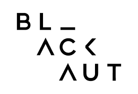

# Curso Creative Coding 2017
**Profesor Roy Macdonald.**

Este es el repositorio de código y material de clases del curso.

Pueden descargar todo este repositorio haciendo clic en el boton download o si es que saben utilizar git lo pueden sincronizar localmente haciendo `git clone https://github.com/blackaut/creativecoding2017.git`

### Temario:

[Clase 1:](clase1/creative_coding_clase1.md)

* [Qué es el creative coding](clase1/creative_coding_clase1.md#qué-es-el-creative-coding)
* [Referentes](clase1/creative_coding_clase1.md#referentes)
* [Herramientas](clase1/creative_coding_clase1.md#herramientas)
* [Nivel del lenguaje](clase1/creative_coding_clase1.md#nivel-del-lenguaje)
* [Fundamentos de la programación.](clase1/creative_coding_clase1.md#fundamentos-de-la-programación)
* [Números](clase1/creative_coding_clase1.md#números)
* [Otros tipos básicos](clase1/creative_coding_clase1.md#otros-tipos-básicos)
* [Variables](clase1/creative_coding_clase1.md#variables)
* [Funciones](clase1/creative_coding_clase1.md#funciones)
* [Condicionales](clase1/creative_coding_clase1.md#condicionales)
* [TAREAS](clase1/creative_coding_clase1.md#tareas)

Clase 2:

* [Flujo de ejecución de Processing](clase2/creative_coding_clase2.md#flujo-de-ejecución-de-processing)
* [Control de flujo y lógica booleana.](clase2/creative_coding_clase2.md#control-de-flujo-y-lógica-booleana)
* * [Lógica booleana](clase2/creative_coding_clase2.md#lógica-booleana)
* * [Combinatorias](clase2/creative_coding_clase2.md#combinatorias)
* * [Paréntesis](clase2/creative_coding_clase2.md#paréntesis)
* [Mouse](clase2/creative_coding_clase2.md#mouse)
* * [Posición](clase2/creative_coding_clase2.md#posición)
* * [Botón](clase2/creative_coding_clase2.md#botón)
* [Teclado](clase2/creative_coding_clase2.md#teclado)
* [Funciones para eventos mouse y teclado](clase2/creative_coding_clase2.md#funciones-para-eventos)
* [for](clase2/creative_coding_clase2.md#for)
* [Random y Noise](clase2/creative_coding_clase2.md#random-y-noise)

Clase 3:

* Variables y su ámbito. 
* Seno y coseno. 
* * Explicación didáctica.
* * Animacion con seno y coseno
* Animación generativa.
* Ejercicios
				
Clase 4:

* Color
* Módulo
* Imagenes y pixeles.
* Manipulación de pixeles.		
* Librerias				
* GUI (Interfaz gráfica de usuario) 
* Espacio tridimensional.
* Dibujo 3D
* Ejercicios
	
Clase 5:

* Clases y Objetos.
* Programación orientada a objetos (OOP).
* Matemática vectorial.
* Sistemas de partículas.
* Recursion
	
Clase 6:

* Comunicación con otros programas.
* OSC y MIDI
* Manipulación de sonido.
* Análisis de audio. FFT y Detección de frecuencia.
* Sintesis FM y AM
* Sintesis Granular.
* Loops de audio.
* Secuenciador de pasos. (Step sequencer)

* Ejercicios
		
Clase 7: 

* Vision Computacional (Open Cv)
* Face tracker
* Optical Flow
* Trackeo de objetos de colores
* Camara IR
* Kinect
* Compartir video en tiempo real con otras aplicaciones mediante Syphon o Spout.

Clase 8:

* Integración de todo lo aprendido
* Taller de experimentación