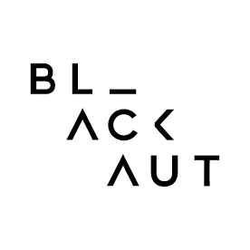

### CURSO CREATIVE CODING 2017
** Curso de creative coding (programación creativa) dictado por Roy J. Macdonald.   **

# CLASE 2
## Flujo de ejecución de Processing

Hasta ahora vimos como utilizar Processing en su modo "estático", esto es que las instrucciones que escribimos se ejecutan solo una vez. Vimos una introducción al modo "activo", el cual tiene un potencial mucho mayor. 
El modo activo se caracteriza porque se ejecuta constantemente. Para esto debemos definir dos funciones, [`setup`](https://processing.org/reference/setup_.html) y [`draw`](https://processing.org/reference/draw_.html). Estas tienen la siguiente forma.

	void setup(){
		//instrucciones que solo se ejecutan una vez al iniciar el sketch.
	}
	void draw(){
		//instrucciones que se ejecutan constantemente.
	}	

La función `setup` se ejecuta solo una vez cuando el sketch se inicia. Este es para establecer las condiciones iniciales que queremos que tenga, como tamaño de la ventana, abrir en pantalla completa, tipo de renderer, inicialización de variables, etc.

Luego de que se termina de ejecutar la función `setup` se ejecuta `draw`. Esta última se ejecuta cada  vez que la pantalla se refresca, esto tipicamente ocurre 60 veces por segundo. Esto permite que lo que mostramos en pantalla vaya cambiando en base a lo que programemos.
`draw` seguirá ejecutandose una y otra vez hasta que cerremos el sketch o que se llame la función [`noLoop();`](https://processing.org/reference/noLoop_.html). Si es que detenemos la ejecucion del draw utilizando esta última función podemos hacer que `draw` siga ejecutandose continuamente al llamar la función [`loop();`](https://processing.org/reference/loop_.html)

## Control de flujo y lógica booleana.

Ya vimos como utilizar la el `if` y `else` para controlar la ejecución de las instrucciones, pero solo lo vimos utilizando una variable booleana. Es posible también utilizar operadores relacionales, que determinan la relación entre dos variables o expresiones. Estas relaciones son igual, distinto, mayor que, menor que, mayor o igual que y menor o igual que.
Para esto se utlilizan los siguientes operadores (simbolos):

| Nombre  | Operador | Expresión | Comentario |
| ------------ | ------------- | ------------ | ------------ |
| igual que | `==`  | `mouseX == 200` | se evalua como verdadero solo si la posición en el eje x del mouse es igual a 200. de lo contrario será falso. |
| distinto que | `!=`  | `mouseX != 200` | será verdadero si es que mouseX NO es 200 |
| mayor que | `>`  | `mouseX > 200` | será verdadero si es que mouseX es mayor que 200 |
| mayor o igual que | `>=`  | `mouseX >= 200` | será verdadero si es que mouseX es mayor o igual que 200 |
| menor que | `<`  | `mouseX < 200` | será verdadero si es que mouseX es menor que 200 |
| menor o igual que | `<=`  | `mouseX <= 200` | será verdadero si es que mouseX es menor o igual que 200 |

Podemos utilizar lo que se evalua con estos operadores directamente como la condición de un `if` o lo podemos guardar en una variable booleana. Por ejemplo:

	boolean masQue200 = mouseX > 200;

### Lógica booleana

Podemos también combinar variables `boolean` y o expresiones que se evaluen como verdadero o falso. Esto se hace utilizando los operadores lógicos. Esto son AND (y), OR (ó), NOT (negación) y XOR (eXclusive OR) (o exclusivo).
Al igual que los operadores aritméticos (`+`, `-`, `*` y `/`) los operadores lógicos van entre dos expresiones booleanas.

| Nombre  | Operador | Expresión |
| ------------ | ------------- | ------------ |
| AND | &&  |Esta compara dos expresiones y entrega verdadero solo y solamente si las dos son verdaderas (`true`). 
| OR | \|\| | Esta compara dos expresiones y entrega verdadero si cualquiera de las dos es verdadera. Si las dos son verdaderas tambien entrega verdadero.
| NOT | ! | Esta se usa sobre una expresion o boolean, invirtiendo su valor. 
| XOR | ^ | Compara dos expresiones y entrega verdadero solamente si una de las dos expresiones es verdadera.

**Importante** el caractér de OR es una barra vertical o (pipe en inglés). En el teclado español se encuentra apretando las teclas `alt` y `1`.
  
#### Combinatorias

**AND**

| Operacion | Resultado |
| ------------ | ------------ |
| `true  && true` | `true` |
| `false && true` | `false` |
| `true  && false` | `false` |
| `false && false` | `false` |

**OR**

| Operacion | Resultado |
| ------------ | ------------ |
| `true  \|\| true` | `true` |
| `false \|\| true` | `true` |
| `true  \|\| false` | `true` |
| `false \|\| false` | `false` |

**NOT**

| Operacion | Resultado |
| ------------ | ------------ |
| `!true` | `false` | 
| `!false` | `true` | 

**XOR**

| Operacion | Resultado |
| ------------ | ------------ |
| `true  ^ true` | `false` |
| `false ^ true` | `true` |
| `true  ^ false` | `true` |
| `false ^ false` | `false` |

## Mouse y teclado
## for
## Random y Noise
## Animación generativa.
## Seno y coseno. Explicación didáctica.
## Ejercicios
